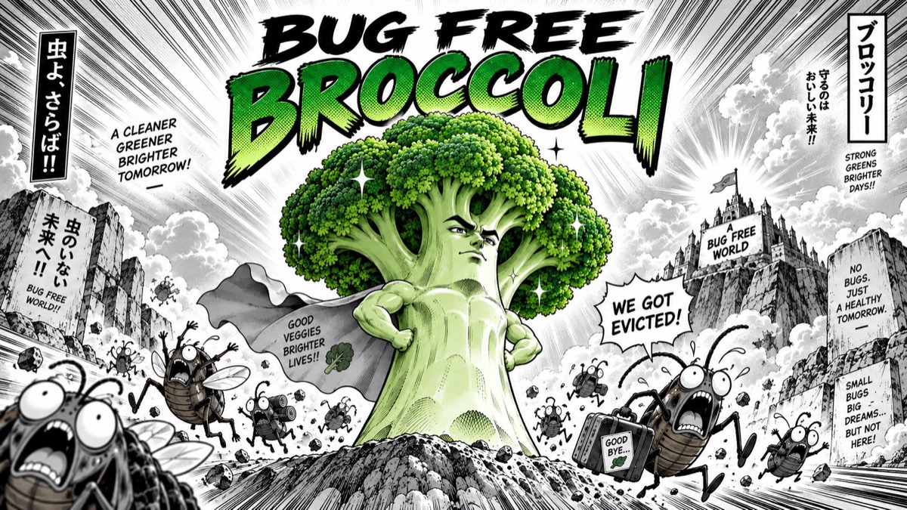

# БРОККОЛИ БЕЗ ЖУКОВ

*Консервированная. Проверенная. Не шевелится.*

Источник клетчатки, витаминов и уверенности в том, что вилка — единственный движущийся предмет в вашем обеде.

Наша брокколи выращена с заботой о вашем здоровье. Каждый жук прошёл индивидуальное собеседование и получил отказ. Даже с опытом работы в органическом земледелии.

**Состав:** брокколи, вода, соль.  
**Не содержит:** жуков, личинок, незаявленных пассажиров.

**Способ употребления:** открыть, подогреть, съесть. Уговаривать содержимое остаться в тарелке не требуется.

**Полезные свойства:** помогает разнообразить рацион и сократить время на подозрительное разглядывание овощей.

**Внимание:** отсутствие жуков не освобождает от необходимости жевать.

*Брокколи без жуков. Весь белок учтён.*
